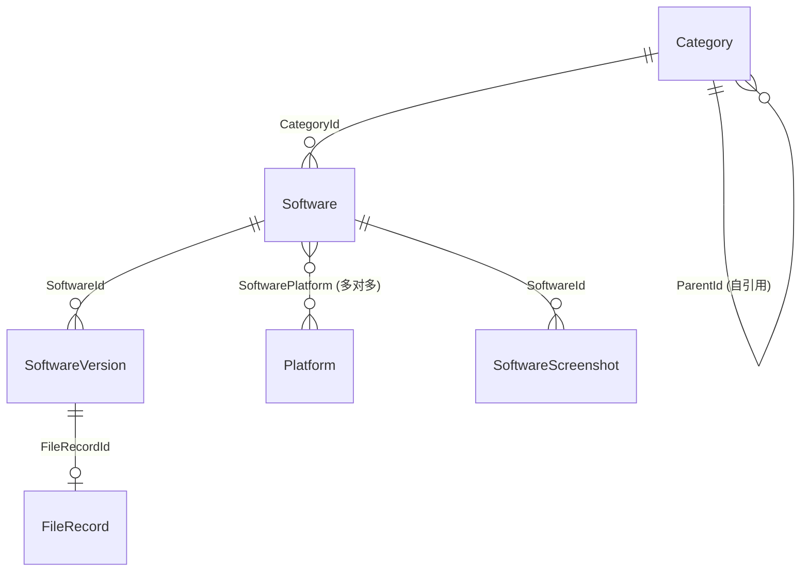

# 个人专属软件下载站 — 软件设计说明书 (SDD)

> 本文档基于《需求规格说明书 (PRD)》和《前端界面设计规范 (UIUX)》，定义系统的技术架构、数据库模型、接口协议、项目组织与编码规范。它是所有编码工作的唯一技术准绳。

---

## 1. 技术选型总览

| 层次         | 技术                                  | 版本 / 备注                          |
| ------------ | ------------------------------------- | ------------------------------------ |
| **前端框架** | Vue 3 (Composition API + `<script setup>`) | 搭配 Vite 构建                       |
| **UI 组件**  | 自研组件 + Lucide Icons               | 遵循 UIUX 设计规范                   |
| **状态管理** | Pinia                                 | —                                    |
| **路由**     | Vue Router 4                          | History 模式                         |
| **HTTP 客户端** | Axios                              | 统一封装请求/响应拦截器              |
| **Markdown** | markdown-it 或 marked                 | 前台详情与后台编辑器                 |
| **后端框架** | ASP.NET Core 8 (Minimal API / Controller) | RESTful 风格                     |
| **ORM**      | Entity Framework Core 8               | Code First + Migrations              |
| **数据库**   | SQLite                                | 轻量、免运维、适合 NAS 单机部署      |
| **认证**     | JWT Bearer Token                      | 全局固定密码换取 Token               |
| **哈希计算** | System.Security.Cryptography (SHA256) | 后台异步队列计算                     |
| **日志**     | Serilog                               | 输出至控制台 + 滚动文件              |
| **部署**     | Docker / 群晖 Container Manager       | 前后端分容器或单容器                 |

---

## 2. 系统架构设计

### 2.1 整体架构图 (C4 - Container Level)

```
┌──────────────────────────────────────────────────────────┐
│                      浏览器 (Browser)                     │
│  ┌─────────────────────┐  ┌────────────────────────────┐ │
│  │  前台 SPA (Vue 3)   │  │  管理后台 SPA (Vue 3)      │ │
│  │  / (Public Routes)  │  │  /admin (Protected Routes) │ │
│  └────────┬────────────┘  └──────────┬─────────────────┘ │
└───────────┼──────────────────────────┼───────────────────┘
            │ HTTP / REST              │ HTTP / REST + JWT
            ▼                          ▼
┌──────────────────────────────────────────────────────────┐
│              ASP.NET Core 8 Web API                      │
│  ┌──────────┐ ┌───────────┐ ┌──────────────────────────┐│
│  │Controller│ │ Services  │ │ Background Services      ││
│  │  Layer   │→│ (Business │→│ (SHA256 Hash Queue)      ││
│  │ (API)    │ │  Logic)   │ │                          ││
│  └──────────┘ └─────┬─────┘ └──────────────────────────┘│
│                     │                                    │
│              ┌──────▼──────┐                             │
│              │ EF Core 8   │                             │
│              │ Repository  │                             │
│              └──────┬──────┘                             │
└─────────────────────┼────────────────────────────────────┘
                      │
        ┌─────────────▼──────────────┐
        │   SQLite Database (.db)    │
        └────────────────────────────┘
                      │
        ┌─────────────▼──────────────┐
        │   NAS 文件系统 (SMB 共享)   │
        │   /volume1/Software/...    │
        └────────────────────────────┘
```

### 2.2 后端分层架构

采用经典三层 + 仓储模式，职责清晰：

| 层                        | 命名空间 / 目录              | 职责                                                         |
| ------------------------- | --------------------------- | ------------------------------------------------------------ |
| **Presentation (API)**    | `Controllers/`              | 接收 HTTP 请求，参数校验，调用 Service，返回统一响应          |
| **Application (Service)** | `Services/`                 | 编排业务逻辑，事务控制，调用 Repository                       |
| **Domain (Models)**       | `Models/`                   | 实体类 (Entity)、枚举 (Enum)、值对象                          |
| **Infrastructure (Data)** | `Data/`                     | DbContext、Repository 实现、Migrations、种子数据              |
| **DTOs**                  | `Dtos/`                     | 请求 DTO (Request)、响应 DTO (Response)，隔离内外模型         |
| **Background Jobs**       | `BackgroundServices/`       | SHA256 异步计算、定时清理任务                                 |

### 2.3 前端分层架构

```
src/
├── api/                    # Axios 封装与各模块 API 调用函数
│   ├── http.ts             # Axios 实例、拦截器、统一错误处理
│   ├── software.ts         # 软件相关 API
│   ├── version.ts          # 版本相关 API
│   ├── category.ts         # 分类相关 API
│   ├── platform.ts         # 平台相关 API
│   ├── dashboard.ts        # 看板统计 API
│   └── auth.ts             # 登录认证 API
├── assets/                 # 静态资源（图标、字体、全局样式）
│   └── styles/
│       ├── variables.css   # CSS 变量 (设计令牌)
│       ├── reset.css       # 样式重置
│       └── global.css      # 全局通用样式
├── components/             # 可复用 UI 组件
│   ├── common/             # 通用组件 (Button, Modal, Drawer, Toast...)
│   └── business/           # 业务组件 (SoftwareCard, VersionTimeline...)
├── composables/            # 组合式函数 (useTheme, useSearch, usePagination...)
├── layouts/                # 布局组件
│   ├── PublicLayout.vue    # 前台布局 (Header + Content)
│   └── AdminLayout.vue     # 后台布局 (Sidebar + Main)
├── router/                 # Vue Router 配置
│   └── index.ts
├── stores/                 # Pinia 状态管理
│   ├── auth.ts             # 认证状态
│   ├── category.ts         # 分类数据缓存
│   └── theme.ts            # 主题 (亮/暗) 状态
├── views/                  # 页面级组件
│   ├── public/             # 前台页面
│   │   ├── HomeView.vue    # 软件大厅 (首页)
│   │   └── DetailView.vue  # 软件详情页
│   └── admin/              # 后台页面
│       ├── LoginView.vue   # 登录页
│       ├── DashboardView.vue # 控制台看板
│       ├── SoftwareListView.vue
│       ├── SoftwareEditView.vue
│       ├── CategoryView.vue
│       ├── PlatformView.vue
│       └── FileScanView.vue  # NAS 扫描入库 (神技页)
├── App.vue
└── main.ts
```

---

## 3. 数据库设计 (SQLite + EF Core)

### 3.1 ER 关系概览



### 3.2 表结构定义

#### 3.2.1 Categories (分类表)
| 列名          | 类型           | 约束                    | 说明                              |
| ------------- | -------------- | ----------------------- | --------------------------------- |
| Id            | CHAR(16)       | PK                      | 16 位 GUID 主键                   |
| Name          | TEXT           | NOT NULL, MAX 100       | 分类名称                          |
| ParentId      | CHAR(16)       | FK → Categories.Id, NULL| 父级分类 ID，NULL 表示顶级分类     |
| SortOrder     | INTEGER        | NOT NULL, DEFAULT 0     | 排序权重，越小越靠前              |
| CreatedAt     | TEXT (ISO8601) | NOT NULL                | 创建时间                          |
| UpdatedAt     | TEXT (ISO8601) | NOT NULL                | 最后更新时间                      |

#### 3.2.2 Platforms (平台表)
| 列名          | 类型           | 约束                    | 说明                              |
| ------------- | -------------- | ----------------------- | --------------------------------- |
| Id            | CHAR(16)       | PK                      | 16 位 GUID 主键                   |
| Name          | TEXT           | NOT NULL, UNIQUE, MAX 50| 平台名称 (Windows / macOS / etc.) |
| IconClass     | TEXT           | NULL, MAX 100           | 图标 CSS 类名或 SVG 标识          |
| ColorHex      | TEXT           | NULL, MAX 7             | 显示颜色 (#0078D4)                |
| SortOrder     | INTEGER        | NOT NULL, DEFAULT 0     | 排序权重                          |
| CreatedAt     | TEXT (ISO8601) | NOT NULL                | 创建时间                          |
| UpdatedAt     | TEXT (ISO8601) | NOT NULL                | 最后更新时间                      |

#### 3.2.3 Softwares (软件表)
| 列名          | 类型           | 约束                    | 说明                              |
| ------------- | -------------- | ----------------------- | --------------------------------- |
| Id            | CHAR(16)       | PK                      | 16 位 GUID 主键                   |
| Name          | TEXT           | NOT NULL, MAX 200       | 软件名称                          |
| Summary       | TEXT           | NULL, MAX 500           | 一句话简介                        |
| Description   | TEXT           | NULL                    | Markdown 格式详细描述             |
| IconPath      | TEXT           | NULL, MAX 500           | 图标文件相对路径                  |
| OfficialUrl   | TEXT           | NULL, MAX 500           | 官方网站链接                      |
| CategoryId    | CHAR(16)       | FK → Categories.Id, NULL| 所属分类                          |
| Status        | INTEGER        | NOT NULL, DEFAULT 1     | 0=Draft(下架), 1=Published(上架)  |
| TotalDownloads| INTEGER        | NOT NULL, DEFAULT 0     | 总下载次数 (冗余字段，定期同步)    |
| CreatedAt     | TEXT (ISO8601) | NOT NULL                | 创建时间                          |
| UpdatedAt     | TEXT (ISO8601) | NOT NULL                | 最后更新时间                      |

#### 3.2.4 SoftwarePlatforms (软件-平台关联表)
| 列名          | 类型           | 约束                    | 说明                              |
| ------------- | -------------- | ----------------------- | --------------------------------- |
| SoftwareId    | CHAR(16)       | PK (复合), FK           | 软件 ID                           |
| PlatformId    | CHAR(16)       | PK (复合), FK           | 平台 ID                           |

#### 3.2.5 SoftwareScreenshots (软件截图表)
| 列名          | 类型           | 约束                    | 说明                              |
| ------------- | -------------- | ----------------------- | --------------------------------- |
| Id            | CHAR(16)       | PK                      | 16 位 GUID 主键                   |
| SoftwareId    | CHAR(16)       | FK → Softwares.Id       | 所属软件                          |
| FilePath      | TEXT           | NOT NULL, MAX 500       | 截图文件相对路径                  |
| SortOrder     | INTEGER        | NOT NULL, DEFAULT 0     | 排序权重                          |
| CreatedAt     | TEXT (ISO8601) | NOT NULL                | 创建时间                          |

#### 3.2.6 SoftwareVersions (版本表)
| 列名          | 类型           | 约束                    | 说明                              |
| ------------- | -------------- | ----------------------- | --------------------------------- |
| Id            | CHAR(16)       | PK                      | 16 位 GUID 主键                   |
| SoftwareId    | CHAR(16)       | FK → Softwares.Id       | 所属软件                          |
| VersionNumber | TEXT           | NOT NULL, MAX 100       | 版本号 (如 v2023.1)              |
| Changelog     | TEXT           | NULL                    | Markdown 更新日志                 |
| FileName      | TEXT           | NOT NULL, MAX 500       | 原始文件名                        |
| FilePath      | TEXT           | NOT NULL, MAX 1000      | NAS 上文件的相对路径              |
| FileSize      | INTEGER        | NOT NULL, DEFAULT 0     | 文件大小 (Bytes)                  |
| HashSHA256    | TEXT           | NULL, MAX 64            | SHA256 校验码 (异步计算后回填)    |
| HashStatus    | INTEGER        | NOT NULL, DEFAULT 0     | 0=Pending, 1=Computing, 2=Done, 3=Failed |
| DownloadCount | INTEGER        | NOT NULL, DEFAULT 0     | 该版本下载次数                    |
| IsVisible     | INTEGER        | NOT NULL, DEFAULT 1     | 0=隐藏, 1=可见                    |
| CreatedAt     | TEXT (ISO8601) | NOT NULL                | 创建时间 (即发布时间)             |
| UpdatedAt     | TEXT (ISO8601) | NOT NULL                | 最后更新时间                      |

### 3.3 索引策略
- `IX_Softwares_CategoryId` — 按分类查询软件。
- `IX_Softwares_Status` — 前台仅查已上架。
- `IX_SoftwareVersions_SoftwareId_CreatedAt` — 版本倒序列表。
- `IX_SoftwareVersions_IsVisible` — 过滤隐藏版本。
- `IX_Categories_ParentId` — 递归查询子分类。

---

## 4. RESTful API 设计

### 4.1 统一响应格式

```json
{
  "code": 200,
  "message": "操作成功",
  "data": { ... }
}
```

错误响应：

```json
{
  "code": 400,
  "message": "版本号不能为空",
  "data": null
}
```

### 4.2 前台公共接口 (无需认证)

| 方法   | 路径                                      | 说明                         |
| ------ | ----------------------------------------- | ---------------------------- |
| GET    | `/api/categories/tree`                    | 获取完整分类树               |
| GET    | `/api/platforms`                          | 获取所有平台列表             |
| GET    | `/api/softwares`                          | 分页查询软件列表 (含筛选排序) |
| GET    | `/api/softwares/{id}`                     | 获取软件详情 (含最新N个版本)  |
| GET    | `/api/softwares/{id}/versions`            | 获取软件的全部可见版本       |
| GET    | `/api/softwares/{id}/versions/{vid}/download` | 触发下载 (计数+1，返回文件流) |

#### 查询参数 (`GET /api/softwares`)

| 参数         | 类型    | 说明                                  |
| ------------ | ------- | ------------------------------------- |
| categoryId   | string? | 分类 ID (含子分类递归)                |
| platformId   | string? | 平台 ID                              |
| keyword      | string? | 名称/简介模糊搜索                    |
| sortBy       | string? | `latest` (默认) / `popular`           |
| page         | int     | 页码，默认 1                          |
| pageSize     | int     | 每页条数，默认 20，最大 50            |

### 4.3 后台管理接口 (需 JWT 认证)

#### 4.3.1 认证

| 方法 | 路径               | 说明                          |
| ---- | ------------------ | ----------------------------- |
| POST | `/api/auth/login`  | 提交密码，成功返回 JWT Token  |

请求体：
```json
{
  "password": "your-global-password"
}
```

#### 4.3.2 控制台看板

| 方法 | 路径                   | 说明                          |
| ---- | ---------------------- | ----------------------------- |
| GET  | `/api/admin/dashboard` | 返回总软件数、版本数、存储空间、下载总量、Top10 |

#### 4.3.3 分类管理

| 方法   | 路径                         | 说明             |
| ------ | ---------------------------- | ---------------- |
| GET    | `/api/admin/categories`      | 获取分类列表(树) |
| POST   | `/api/admin/categories`      | 新建分类         |
| PUT    | `/api/admin/categories/{id}` | 编辑分类         |
| DELETE | `/api/admin/categories/{id}` | 删除分类         |

#### 4.3.4 平台管理

| 方法   | 路径                        | 说明             |
| ------ | --------------------------- | ---------------- |
| GET    | `/api/admin/platforms`      | 获取平台列表     |
| POST   | `/api/admin/platforms`      | 新建平台         |
| PUT    | `/api/admin/platforms/{id}` | 编辑平台         |
| DELETE | `/api/admin/platforms/{id}` | 删除平台         |

#### 4.3.5 软件档案管理

| 方法   | 路径                                    | 说明                   |
| ------ | --------------------------------------- | ---------------------- |
| GET    | `/api/admin/softwares`                  | 分页查询 (含草稿)      |
| GET    | `/api/admin/softwares/{id}`             | 获取详情 (含全部版本)  |
| POST   | `/api/admin/softwares`                  | 新建软件档案           |
| PUT    | `/api/admin/softwares/{id}`             | 编辑软件档案           |
| DELETE | `/api/admin/softwares/{id}`             | 删除软件档案           |
| PATCH  | `/api/admin/softwares/{id}/status`      | 切换上架/下架状态      |
| POST   | `/api/admin/softwares/{id}/icon`        | 上传软件图标           |
| POST   | `/api/admin/softwares/{id}/screenshots` | 上传软件截图 (多图)    |
| DELETE | `/api/admin/softwares/{id}/screenshots/{sid}` | 删除单张截图   |

#### 4.3.6 版本与文件管理

| 方法   | 路径                                               | 说明                              |
| ------ | -------------------------------------------------- | --------------------------------- |
| GET    | `/api/admin/softwares/{id}/versions`                | 获取某软件全部版本 (含隐藏)       |
| POST   | `/api/admin/softwares/{id}/versions`                | 新建版本 (绑定 NAS 文件路径)      |
| PUT    | `/api/admin/versions/{vid}`                         | 编辑版本信息                      |
| DELETE | `/api/admin/versions/{vid}?deleteFile=false`        | 删除版本 (软/硬删除)             |
| PATCH  | `/api/admin/versions/{vid}/visibility`              | 切换版本可见性                    |

#### 4.3.7 NAS 文件扫描

| 方法 | 路径                         | 说明                                  |
| ---- | ---------------------------- | ------------------------------------- |
| GET  | `/api/admin/files/scan`      | 扫描 NAS 目录，返回未绑定的孤儿文件列表 |
| POST | `/api/admin/files/bind`      | 一键入库：绑定文件到指定软件+版本     |

`POST /api/admin/files/bind` 请求体：
```json
{
  "filePath": "/volume1/Software/Dev/idea-2023.exe",
  "softwareId": "a1b2c3d4e5f67890",
  "versionNumber": "2023.3.1",
  "changelog": "## 更新内容\n- 修复了若干 Bug"
}
```

---

## 5. 后端项目结构 (.NET 8)

```
DownloadStation.Server/
├── DownloadStation.Server.csproj
├── Program.cs                          # 应用入口、服务注册、中间件管道
├── appsettings.json                    # 配置文件 (连接字符串、NAS路径、JWT密钥等)
├── Controllers/                        # API 控制器
│   ├── Public/                         # 前台公共接口
│   │   ├── CategoriesController.cs
│   │   ├── PlatformsController.cs
│   │   ├── SoftwaresController.cs
│   │   └── DownloadController.cs
│   └── Admin/                          # 后台管理接口
│       ├── AuthController.cs
│       ├── DashboardController.cs
│       ├── AdminCategoriesController.cs
│       ├── AdminPlatformsController.cs
│       ├── AdminSoftwaresController.cs
│       ├── AdminVersionsController.cs
│       └── AdminFilesController.cs
├── Services/                           # 业务逻辑层
│   ├── Interfaces/                     # 服务接口定义
│   │   ├── ICategoryService.cs
│   │   ├── IPlatformService.cs
│   │   ├── ISoftwareService.cs
│   │   ├── IVersionService.cs
│   │   ├── IFileService.cs
│   │   ├── IDashboardService.cs
│   │   └── IAuthService.cs
│   └── Implementations/               # 服务实现
│       ├── CategoryService.cs
│       ├── PlatformService.cs
│       ├── SoftwareService.cs
│       ├── VersionService.cs
│       ├── FileService.cs
│       ├── DashboardService.cs
│       └── AuthService.cs
├── Models/                             # 实体类
│   ├── Category.cs
│   ├── Platform.cs
│   ├── Software.cs
│   ├── SoftwarePlatform.cs
│   ├── SoftwareScreenshot.cs
│   ├── SoftwareVersion.cs
│   └── Enums/
│       ├── SoftwareStatus.cs           # Draft = 0, Published = 1
│       └── HashStatus.cs              # Pending = 0, Computing = 1, Done = 2, Failed = 3
├── Dtos/                               # 数据传输对象
│   ├── Requests/                       # 请求模型
│   │   ├── LoginRequest.cs
│   │   ├── CategoryCreateRequest.cs
│   │   ├── CategoryUpdateRequest.cs
│   │   ├── PlatformCreateRequest.cs
│   │   ├── PlatformUpdateRequest.cs
│   │   ├── SoftwareCreateRequest.cs
│   │   ├── SoftwareUpdateRequest.cs
│   │   ├── VersionCreateRequest.cs
│   │   ├── VersionUpdateRequest.cs
│   │   └── FileBindRequest.cs
│   └── Responses/                      # 响应模型
│       ├── ApiResponse.cs              # 统一响应包装器
│       ├── CategoryTreeResponse.cs
│       ├── PlatformResponse.cs
│       ├── SoftwareListResponse.cs
│       ├── SoftwareDetailResponse.cs
│       ├── VersionResponse.cs
│       ├── DashboardResponse.cs
│       ├── UnboundFileResponse.cs
│       └── PagedResult.cs              # 分页结果包装器
├── Data/                               # 数据访问层
│   ├── AppDbContext.cs                 # EF Core DbContext
│   ├── Configurations/                 # 实体配置 (Fluent API)
│   │   ├── CategoryConfiguration.cs
│   │   ├── PlatformConfiguration.cs
│   │   ├── SoftwareConfiguration.cs
│   │   ├── SoftwarePlatformConfiguration.cs
│   │   ├── SoftwareScreenshotConfiguration.cs
│   │   └── SoftwareVersionConfiguration.cs
│   └── Migrations/                     # EF Core 迁移文件 (自动生成)
├── BackgroundServices/                 # 后台托管服务
│   └── HashComputeService.cs           # SHA256 异步计算队列
├── Middleware/                         # 自定义中间件
│   └── ExceptionHandlingMiddleware.cs  # 全局异常捕获
├── Helpers/                            # 工具类
│   ├── FileHelper.cs                   # 文件操作、大小格式化
│   └── HashHelper.cs                   # SHA256 计算
└── Extensions/                         # 扩展方法
    └── ServiceCollectionExtensions.cs  # DI 注册扩展
```

---

## 6. 关键设计决策

### 6.1 认证机制 (JWT)
- 管理员通过 `POST /api/auth/login` 提交全局固定密码。
- 服务端校验后签发 JWT Token，有效期可配置（默认 24 小时）。
- 后台所有 `/api/admin/**` 接口均要求 `Authorization: Bearer <token>` 请求头。
- 前端将 Token 存入 `localStorage`，Axios 拦截器自动附加。

### 6.2 文件存储策略
- **NAS 软件包**：存储在配置文件指定的 `StorageBasePath` 目录（如 `/volume1/Software`），应用直接读取物理路径提供下载流。
- **图标与截图**：存储在应用数据目录的 `uploads/` 子目录中，通过静态文件中间件提供访问。数据库中仅保存相对路径。
- **下载接口**：使用 `PhysicalFile()` 返回文件流，设置正确的 `Content-Disposition` 和 `Content-Type`。

### 6.3 SHA256 异步计算
- 版本入库时，`HashStatus` 初始为 `Pending`。
- `HashComputeService` 后台服务以队列方式轮询 `Pending` 状态的记录。
- 计算完成后更新 `HashSHA256` 字段并将状态改为 `Done`。
- 对于大文件（如 5GB 镜像），使用流式分块计算，避免内存溢出。

### 6.4 下载计数
- `GET /api/softwares/{id}/versions/{vid}/download` 接口在返回文件流前，先异步对 `SoftwareVersion.DownloadCount` 执行 `+1` 操作。
- `Software.TotalDownloads` 为冗余字段，通过定期同步或触发式聚合更新。

### 6.5 分类递归查询
- SQLite 支持 CTE (Common Table Expression)，使用递归 CTE 查询某分类及其所有子孙分类的 ID 集合，再进行软件筛选。
- EF Core 中可使用 `FromSqlRaw()` 执行递归查询。

---

## 7. 编码规范与约定

### 7.1 C# 后端规范

#### 命名约定
| 类型                | 风格             | 示例                           |
| ------------------- | ---------------- | ------------------------------ |
| 命名空间            | PascalCase       | `DownloadStation.Server.Services` |
| 类 / 接口           | PascalCase       | `SoftwareService` / `ISoftwareService` |
| 公共方法 / 属性     | PascalCase       | `GetByIdAsync()` / `TotalDownloads` |
| 私有字段            | _camelCase       | `_dbContext` / `_logger`       |
| 局部变量 / 参数     | camelCase        | `softwareId` / `pageSize`      |
| 常量                | PascalCase       | `DefaultPageSize`              |
| 枚举值              | PascalCase       | `HashStatus.Computing`         |
| 异步方法            | 以 Async 结尾    | `CreateAsync()` / `DeleteAsync()` |

#### XML 注释规范
所有公共和私有的类、接口、方法、属性、字段、枚举等，必须使用 C# 标准 XML 注释（`///`），注释内容需完整、语义明确。示例：

```csharp
/// <summary>
/// 软件档案管理服务，负责软件的增删改查及状态切换等业务逻辑。
/// </summary>
public class SoftwareService : ISoftwareService
{
    /// <summary>
    /// 数据库上下文实例。
    /// </summary>
    private readonly AppDbContext _dbContext;

    /// <summary>
    /// 根据 ID 获取软件详情，包含关联的分类、平台和最新版本信息。
    /// </summary>
    /// <param name="id">软件的 16 位 GUID 标识。</param>
    /// <returns>软件详情响应 DTO，若未找到则返回 null。</returns>
    /// <exception cref="ArgumentException">当 <paramref name="id"/> 为空或格式不合法时抛出。</exception>
    public async Task<SoftwareDetailResponse?> GetByIdAsync(string id)
    {
        // 使用 Include 一次性加载关联数据，避免 N+1 查询问题
        ...
    }
}
```

#### 关键逻辑注释
- 在关键业务逻辑、复杂判断、非直观实现处添加行内注释，解释"为什么这样做"。
- 保持简洁、克制、直指核心，避免对显而易见代码的逐行解释。

#### 异常处理
- Controller 层不做 try-catch（除特殊场景），统一由 `ExceptionHandlingMiddleware` 全局捕获并返回标准错误响应。
- Service 层对业务异常抛出自定义异常（如 `NotFoundException`、`BusinessException`）。

### 7.2 Vue 前端规范

#### 命名约定
| 类型                | 风格             | 示例                           |
| ------------------- | ---------------- | ------------------------------ |
| 组件文件名          | PascalCase       | `SoftwareCard.vue`             |
| 组合式函数文件名    | camelCase        | `useSearch.ts`                 |
| API 函数            | camelCase        | `getSoftwareList()`            |
| 常量                | UPPER_SNAKE_CASE | `DEFAULT_PAGE_SIZE`            |
| CSS 类名            | kebab-case / BEM | `software-card__title`         |
| 路由 name           | kebab-case       | `software-detail`              |

#### 组件规范
- 统一使用 `<script setup lang="ts">` + Composition API。
- Props 使用 `defineProps<T>()` 类型化定义。
- Emits 使用 `defineEmits<T>()` 类型化定义。
- 组件模板中为所有交互元素设置唯一 `id` 属性，便于测试。

#### CSS 规范
- 全局设计令牌定义在 `variables.css` 中，使用 CSS 自定义属性 (`--color-primary` 等)。
- 组件内样式使用 `<style scoped>`，避免全局污染。
- 遵循 UIUX 设计规范中的色彩、阴影、圆角、字体定义。

---

## 8. 配置与环境

### 8.1 appsettings.json 核心配置项

```json
{
  "ConnectionStrings": {
    "DefaultConnection": "Data Source=downloadstation.db"
  },
  "AppSettings": {
    "StorageBasePath": "/volume1/Software",
    "UploadBasePath": "./uploads",
    "AdminPassword": "your-strong-password-here",
    "JwtSecret": "your-jwt-secret-key-at-least-32-chars",
    "JwtExpirationHours": 24
  },
  "Serilog": {
    "MinimumLevel": "Information"
  }
}
```

### 8.2 CORS 策略
开发环境允许前端 dev server 的跨域请求。生产环境通过反向代理 (Nginx) 统一入口，无需 CORS。

---

## 9. 部署架构

```
┌─────────────────────────────────────────────────┐
│               群晖 NAS (DSM 7.x)                │
│                                                  │
│  ┌─────────────────────────────────────────────┐│
│  │          Docker / Container Manager          ││
│  │  ┌───────────────┐  ┌────────────────────┐  ││
│  │  │ Nginx (反向代理)│  │ .NET 8 Runtime     │  ││
│  │  │  Port 80/443  │──│ ASP.NET Core App   │  ││
│  │  │  静态文件(Vue) │  │   Port 5000        │  ││
│  │  └───────────────┘  └────────┬───────────┘  ││
│  └──────────────────────────────┼──────────────┘│
│                                 │                │
│  ┌──────────────────────────────▼──────────────┐│
│  │         /volume1/Software/ (SMB 共享)        ││
│  │         downloadstation.db (SQLite)          ││
│  └─────────────────────────────────────────────┘│
└─────────────────────────────────────────────────┘
```

- **前端**：Vue 项目 build 后的静态文件由 Nginx 托管，SPA 路由使用 `try_files` 回退。
- **后端**：ASP.NET Core 8 应用监听 5000 端口，Nginx 代理 `/api/**` 到后端。
- **数据卷挂载**：SQLite 数据库文件和 NAS 软件目录通过 Docker Volume 挂载到容器内。
